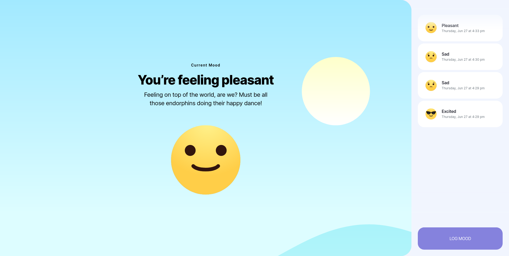
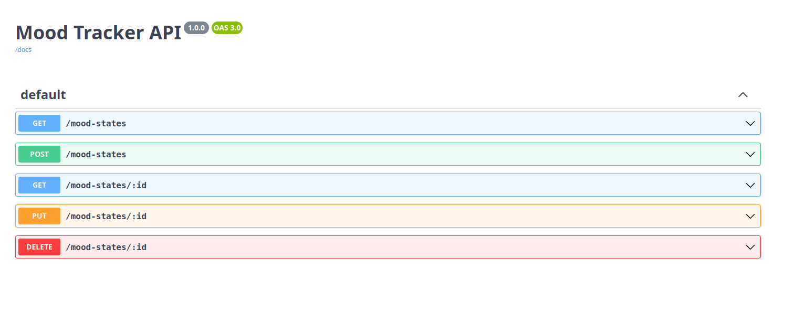

# Mood Tracker

This is an application (frontend and backend) for a Mood Tracker functionality built for a [MetaLab](https://metalab.com) assignment.

- [Next.js](https://nextjs.org) for frontend
- [Hono](https://hono.dev) for backend
- [Prisma](https://prisma.io) for ORM
- [Postgres](https://postgresql.org) for Database
- [Docker](https://docker.com) for Containerization

## Getting Started

Make sure you have installed:

- [Node.js](https://nodejs.org)
- [Docker](https://docker.com)
- [pnpm](https://pnpm.io) Recommended

## Running

### Clone this repository

```
git clone https://github.com/hrqmonteiro/mood-tracker
```

### Configuration

Create a `.env` on both `frontend` and `backend` folders following their respective `.env.example` files, example:

```
API_VERSION="" // for instance v1
DATABASE_URL="" // postgresql://
PORT= // 8000
```

```
NEXT_PUBLIC_BASE_URL="" // link to your backend
```

### Frontend

- Installing dependencies and running locally (development mode)

```
pnpm install
pnpm dev
```

- Running on production

```
pnpm build
pnpm start
```

<br>



<br>

### Backend

- Installing dependencies and running locally (development mode)

```
pnpm install
pnpm dev
```

- Running on production

```
pnpm start
```

#### Swagger (OpenAPI) Docs:

- After running backend, open:

```
http://localhost:8000/api
```

<br>



<br>

### Docker compose

Run the `docker-compose.yml` file:

```
docker compose up -d
docker exec mood-tracker-backend npx prisma migrate dev // run the migrations os prisma in case network missed
```
